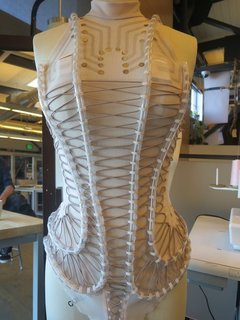
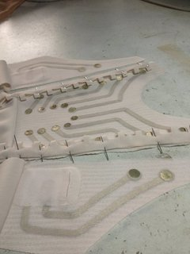

# Designing eTextiles for the Body: Shape, Volume & Motion

A workshop at [ACM TEI 2018](https://tei.acm.org/2018/).

## Call for Participation

Our clothing is not flat, but rather conforms and adapts to our bodies. In this hands-on workshop, participants will experiment and create 3D eTextile garments, while discussing the rich history, current state and possible future directions of wearables.

Through garment construction and rapid prototyping, we will explore how to integrate eTextiles into volumetric, tailored garments that better conform to the shape of the human body, and better respond to its movements. We will show examples of connectors and sensors, and discuss the affordances and limitations of various textiles.

A short masterclass will introduce a range of techniques for garment design and construction, ensuring the workshop is suitable for all skill levels. We will include a brief history of wearables and eTextiles, and an overview of recent innovations within HCI and fashion. We encourage people to bring existing projects and ideas, as well as their own materials and preferred microcontrollers.

 

## Studio Abstract

In this studio, we will improve our tailoring skills in order to better integrate technology into clothing. Leveraging the volumetric nature of clothing, we will create eTextile interfaces that fit the shape of the body and are designed around how bodies move. This studio will consist of a short masterclass led by an expert fashion designer followed by materials experimentation and working on individual projects. We will introduce and demo a variety of ways to design and implement 3- dimensional eTextiles as well as how to integrate them with interactive systems.

## Studio Coordinator Information

#### Rachel Freire

Rachel Freire Studio - London, United Kingdom

[www.rachelfreire.com](http://www.rachelfreire.com) - [rachel@rachelfreire.com](mailto:rachel@rachelfreire.com)

Rachel Freire is an artist and designer who uses the body as a canvas. Her work combines material innovation and electronics with traditional craftsmanship, focusing on provocative narratives, value attribution, and sustainable processes. Freire studied Design for Performance at Central Saint Martins, launching her conceptual fashion label on the catwalks of London Fashion Week 2009\. She has been featured by W, Vogue Italia, Interview, and Make. She is the textile designer of mi.mu gloves, a gestural interface to compose and perform music with your hands. Her work is designed to tell stories, or to inspire them.

#### Paul Strohmeier

Human Centred Computing - University of Copenhagen, Denmark

[paulstrohmeier.info](http://www.paulstrohmeier.info) - [p.strohmeier@di.ku.dk](mailto:p.strohmeier@di.ku.dk)

Paul Strohmeier is a PhD Fellow at the University of Copenhagen's Human Centred Computing group. He is interested in Soft Electronics, Haptic Feedback and Perception. His research reflects his interest in both hardware prototyping as well as the phenomenology of perception. He completed his Msc at Queen’s University, Kingston and his BA at University College Maastricht.

#### Jarrod Knibbe

Human Centred Computing - University of Copenhagen, Denmark

[jarrodknibbe.com](http://jarrodknibbe.com) - [jarrod@di.ku.dk](mailto:jarrod@di.ku.dk)

Jarrod Knibbe is a postdoc at the University of Copenhagen's Human Centred Computing group. He conducts research into Electrical Muscle Stimulation (EMS), where he is exploring pose-creation, auto- calibration, and user perception. Alongside this, Jarrod is working closely with colleagues from the Centre for Subjectivity Research to use novel technologies to explore and exploit our body image and schema, and our sense of control.

#### Cedric Honnet

Sorbonne Universities

UPMC, CNRS, ISIR - Paris, France

[www.honnet.eu](http://www.honnet.eu) - [cedric@honnet.eu](mailto:cedric@honnet.eu)

Cedric Honnet is research engineer in the HCI group at ISIR, the robotics lab of Sorbonne University, Paris. With a background in embedded systems engineering, he explores physical computing and interactivity by travelling the world of hackerspaces. He worked as firmware engineer and "interHacktivist" at Sifteo in San Francisco, then co-founded a couple of companies and got to create interactive systems worldwide. He has developed textile musical controllers, virtual reality bike systems, interactive art pieces, and other Open Source projects.

#### Sophia Brueckner

Stamps School of Art & Design,

University of Michigan - Ann Arbor, MI, USA

[www.sophiabrueckner.com](http://www.sophiabrueckner.com) - [sbrueckn@umich.edu](mailto:sbrueckn@umich.edu)

Sophia Brueckner is a futurist artist, designer, and engineer. Inseparable from computers since the age of two, she believes she is a cyborg. At Google, she built products for millions. At RISD and the MIT Media Lab, she built sci-fi-inspired devices for mental well-being. She teaches a renowned class on sci-fi prototyping and technology ethics. Her work was featured by Wired, SIGGRAPH, NPR, and more. As an assistant professor at the University of Michigan, she combines design and engineering with the perspective of an artist to create technologies that inspire a more positive future.

## Studio Proposed Schedule

Our workshop will last a full 8 hour day and can accommodate 12 participants. The morning session will be dedicated to learning, demos and discussion. The afternoon session will be practical making and we will end with a review to share findings

09:00 Introductions (Paul)

09:45 Coffee Break

10:00 Presentation: eTextiles (Sophia) \\
A brief overview of recent innovations within HCI and fashion. Process of designing Embodisuit and SecondSkin.

10:45 Masterclass (Rachel) \\
An informal presentation introducing different methods of garment construction: Pattern cutting, draping techniques, materials overview. The aim is to equally facilitate both beginners and those with prior experience. Ways of thinking about, designing and implementing 3-dimensional eTextile design. Examples of how traditional tailoring techniques can be employed and adapted for electronics integration. (Rachel)

12:30 Lunch Break

13:15 Prototyping Workshop  \\
Free-form workshop and rapid prototyping session. Small groups will work on actualizing their ideas using the materials available as well as any materials they may have brought with them. Discussion and collaboration between groups will be encouraged, especially if the morning discussion finds areas of overlap in desired outcomes. Individuals and groups will be encouraged to create full garments or to make smaller samples that embody relevant techniques to apply after the workshop. We also encourage those without specific outcomes to experiment with both materials and form in a more fluid manner.

15:00 Coffee Break

17:00 Review of the day’s activities, allowing participants to exchange findings and share work in an informal round table discussion.

18:00 End

All work in progress will be documented as textile techniques often become opaque when a garment is finished. This documentation is not required for participation, but we would prefer all participants are willing to have their work recorded and shared as part of the event. If this is not possible and you wish to partake, please contact us and let us know why and what the necessary restrictions are to ensure there are no issues on the day.

## Contact

Google group: [https://groups.google.com/forum/#!forum/3dTextiles](https://groups.google.com/forum/#!forum/3dTextiles)

Email everyone: [3dTextiles@googlegroups.com](mailto:3dTextiles@googlegroups.com)

Email organisers: [3dTextiles+owners@googlegroups.com](mailto:3dTextiles+owners@googlegroups.com)

